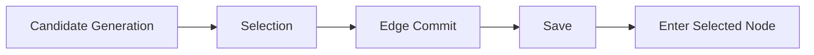

# NO-ROOT

**2D Side-View Expedition Action RPG**  
**Unity 6 / C# · 개인 프로젝트 · 개발 진행 중**

전투, 캐릭터 성장, 원정 경로 선택, 저장·복원을 연결하는 Gameplay Runtime을 설계하고 구현하는 개인 게임 프로젝트입니다. 플레이어의 행동이 여러 시스템을 거쳐 반영될 때, 각 상태의 책임과 전이 순서를 명확하게 관리하는 데 중점을 두고 있습니다.

## Project Overview

| 항목 | 내용 |
| --- | --- |
| 프로젝트 | NO-ROOT |
| 장르 | 2D Side-View Expedition Action RPG |
| 엔진 / 언어 | Unity 6 / C# |
| 개발 형태 | 개인 프로젝트 |
| 주요 담당 | Gameplay Programming / Combat / Ability Runtime / Character Progression / Hybrid Expedition / Persistence / Runtime Validation / UI Integration |

## Representative Systems

| 시스템 | 핵심 구조와 관심사 |
| --- | --- |
| **Combat Ability Runtime** | Ready / Startup / Active / Recovery / Cooldown으로 스킬 실행 단계를 구분하고, 실행 상태와 재사용 조건을 관리합니다. |
| **Branching Character Progression** | Human / SourceBuild 성장 구조와 전투 능력의 연결을 다룹니다. |
| **Hybrid Expedition** | Candidate Generation → Selection → Edge Commit → Save → Enter Selected Node 순서로 후보 제시, 선택 확정, 저장, 입장을 분리합니다. |
| **Persistence / Retry / Restore** | deterministic candidate, candidate snapshot, exact-once selection을 통해 후보·선택의 일관성을 다룹니다. Retry와 New Run의 생명주기를 분리합니다. |
| **Runtime Validation / Debugging** | HumanQMissing, Final Boss progression issue 등 실행 상태와 진행 흐름에 관련된 디버깅 사례를 정리합니다. 세부 근거 공개 상태는 디버깅 문서에 표시합니다. |

## Architecture at a Glance

아래는 원정 경로 선택의 **개념 흐름**입니다. 실제 구현 발췌는 별도의 [Code Samples](code-samples/README.md)에서 확인할 수 있습니다.

후보를 만드는 시점, 선택을 확정하는 시점, 다음 노드로 이동하는 시점을 구분합니다. 저장·복원과 재도전에서도 이미 제시한 후보와 확정한 선택을 일관되게 유지하는 것이 핵심 설계 관심사입니다.

[아키텍처 문서에서 자세히 보기 →](docs/architecture.md)

## Technical Documents

| 문서 | 살펴볼 내용 |
| --- | --- |
| [Architecture](docs/architecture.md) | 전투 실행 단계, 성장 분기, 원정 선택, 저장·복원의 상태와 책임 |
| [Troubleshooting](docs/troubleshooting.md) | HumanQMissing / Final Boss 진행 문제의 사례와 검증 관점 |
| [수정 전후 근거](docs/evidence/troubleshooting.md) | 실제 수정 커밋 2건의 선별 diff와 회귀 검사 설명 |
| [Development Workflow](docs/development-workflow.md) | 요구사항부터 구현, 검증, Git 기록, Unity 통합 확인까지의 과정 |
| [Code Samples](code-samples/README.md) | 원본 12개 파일의 코드·테스트 발췌, 출처와 생략 범위 |
| [Evidence Manifest](evidence-manifest.json) | 원본 파일·Blob SHA와 발췌 코드 SHA-256 목록 |
| [Images & Gameplay](images/README.md) | 스크린샷·GIF·플레이 영상의 준비 상태 |

## Development Workflow

**Requirement → Implementation → Static/Automated Validation → Commit → Push → Unity Integration Validation**

구현과 검증을 하나의 흐름으로 관리합니다. 정적 점검, 실제 실행한 자동 테스트, Unity에서 확인한 통합 동작을 구분하여 기록하며, 실행하지 않은 검증을 통과했다고 표현하지 않습니다.

## Public Portfolio Scope

원본 개발 저장소 **`ShinInHa12/My-project`는 Private으로 유지**합니다. 이 공개 저장소는 NO-ROOT의 기술 소개, 설계 문서, 선별된 코드 샘플을 위한 별도 포트폴리오입니다.

현재 공개 내용은 설계 문서, 원본 12개 파일에서 선별한 코드·테스트 발췌, 실제 수정 diff 2건입니다. 각 문서에 원본 파일·기준 커밋·생략 범위를 표기했습니다. 이미지와 플레이 영상은 공개 범위 확인 후 추가할 예정입니다. 전체 Unity 프로젝트, 원본 Git 이력, 외부·유료 Unity Asset, 인증 정보 및 라이선스가 확인되지 않은 파일은 포함하지 않습니다.

이 저장소만으로 게임을 빌드하거나 실행할 수는 없습니다. 코드 발췌는 읽기용이며, 이번 증빙 공개 작업에서는 Unity 컴파일·Test Runner·실제 플레이를 실행하지 않았습니다.

## Links

- [GitHub Profile — ShinInHa12](https://github.com/ShinInHa12)
- **Notion Portfolio:** [신인하 | Game Programmer Portfolio](https://efficient-van-803.notion.site/GAME-PROGRAMMER-PORTFOLIO-3d32ad00104a81fda6a5dc07059688c4?pvs=143)
