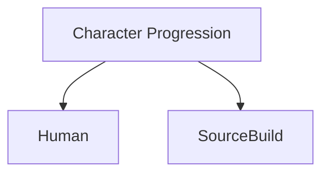
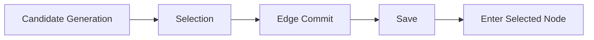

# NO-ROOT — Architecture

NO-ROOT는 **Unity 6 / C# 기반의 개인 개발 2D Side-View Expedition Action RPG**입니다. Gameplay Programming, Combat, Ability Runtime, Character Progression, Hybrid Expedition, Persistence, Runtime Validation, UI Integration을 주요 개발 영역으로 다룹니다.

이 문서는 주요 시스템의 역할과 상태 경계를 설명하는 **포트폴리오용 개념 구조 문서**입니다. 도식은 시스템을 이해하기 위한 요약이며, 원본 코드의 클래스 구성이나 모든 실행 분기를 나타내지는 않습니다. 실제 Unity 프로젝트는 비공개로 관리합니다.

## 시스템 구성

| 영역 | 주요 주제 | 설계에서 확인하는 경계 |
| --- | --- | --- |
| Combat Ability Runtime | Ready / Startup / Active / Recovery / Cooldown | 능력의 준비, 발동, 회복, 재사용 상태 |
| Branching Character Progression | Human / SourceBuild | 성장 경로별 상태와 진행 조건 |
| Hybrid Expedition | 후보 생성, 선택, 이동 확정, 저장, 진입 | 선택 중인 상태와 확정된 진행 상태 |
| Persistence / Retry / Restore | 후보 재현, 후보 스냅샷, 선택 확정, 재시도 | 복원할 상태와 새 원정에서 초기화할 상태 |
| Runtime Validation / Debugging | 능력 누락, 진행 문제의 원인 추적 | 요구사항과 실제 실행 상태의 일치 여부 |
| UI Integration | 플레이어 입력과 런타임 상태 표시 | 입력 시점, 표시 상태, 실행 상태의 연결 |

## 1. Combat Ability Runtime

능력의 실행 과정을 `Ready`, `Startup`, `Active`, `Recovery`, `Cooldown`으로 구분합니다. 상태를 명시적으로 나누면 능력 사용 가능 여부와 실행 중인 단계를 기준으로 동작을 설명하고 문제를 추적할 수 있습니다.

| 상태 | 개념적 의미 |
| --- | --- |
| `Ready` | 능력 사용을 준비하는 상태 |
| `Startup` | 발동을 시작하고 준비 동작을 진행하는 단계 |
| `Active` | 능력이 활성화되는 단계 |
| `Recovery` | 발동 이후 회복하는 단계 |
| `Cooldown` | 재사용을 기다리는 상태 |

각 상태의 정확한 시간, 입력 허용 조건, 판정 시점, 전환 예외는 개별 능력의 구현과 검증에서 다루는 내용입니다. 이 문서는 해당 값이나 전환 규칙을 임의로 제시하지 않습니다.

## 2. Branching Character Progression

캐릭터 성장은 `Human`과 `SourceBuild`로 분기하는 구조를 다룹니다. 두 명칭은 성장 구조를 설명하기 위한 내부 식별자입니다.

성장 구조에서 살펴보는 핵심은 현재 경로, 진행 조건, 사용 가능한 능력, 저장 및 복원 상태 사이의 관계입니다. 특정 성장 경로에서 능력이 누락되거나 진행이 멈추는 문제도 이 상태 관계를 기준으로 추적합니다. 이 개념도는 경로 선택 시점, 경로 간 전환 가능 여부, 세부 성장 수치를 정의하지 않습니다.

## 3. Hybrid Expedition

원정 진행은 다음 흐름으로 설명합니다.

| 단계 | 역할 |
| --- | --- |
| Candidate Generation | 다음 진행을 위한 후보를 생성합니다. |
| Selection | 생성된 후보에서 진행할 대상을 선택합니다. |
| Edge Commit | 선택에 따른 이동 연결을 확정합니다. |
| Save | 확정한 진행 상태를 저장합니다. |
| Enter Selected Node | 선택한 노드에 진입합니다. |

이 흐름의 중요한 경계는 **후보를 보여주는 시점**, **선택을 확정하는 시점**, **진행 상태를 저장하는 시점**, **실제 노드로 진입하는 시점**입니다. 각 단계의 상태를 구분하면 선택과 이동 사이에서 문제가 발생했을 때 어느 상태부터 확인해야 하는지 정리할 수 있습니다.

## 4. Persistence / Retry / Restore

저장과 복원은 원정의 진행 상태를 일관되게 이어가기 위한 영역입니다. 이 프로젝트에서 다루는 대표 주제는 다음과 같습니다.

| 주제 | 설명 | 검증 관점 |
| --- | --- | --- |
| Deterministic candidate | 후보 생성 결과의 재현성을 다룹니다. | 동일한 생성 조건에서 후보가 일관되게 재현되는가? |
| Candidate snapshot | 특정 시점의 후보 상태를 보존하는 개념입니다. | 복원한 후보가 저장 시점의 선택 맥락을 유지하는가? |
| Exact-once selection | 선택 확정을 한 번만 반영하는 성질을 다룹니다. | 중복 처리로 진행 상태가 추가 변경되지 않는가? |
| Retry lifecycle | 재시도에 필요한 상태 유지와 초기화 범위를 다룹니다. | 재시도 시 이어갈 상태와 초기화할 상태가 구분되는가? |
| New run lifecycle | 새 원정을 시작하는 수명주기를 다룹니다. | 이전 원정의 상태가 새 원정의 진행에 섞이지 않는가? |
| Restore | 저장된 상태를 실행 상태로 복원하는 과정을 다룹니다. | 복원 이후에도 다음 선택과 진행이 일관되는가? |

위 항목은 설계 주제와 검증 관점을 설명합니다. 저장 형식, 데이터 필드, 생성 알고리즘, 복원 함수, 실패 처리 방식은 이 문서에서 공개하거나 추정하지 않습니다.

## 5. Runtime Validation과 UI Integration

`HumanQMissing`과 Final Boss progression issue는 프로젝트에서 다룬 실제 디버깅 사례입니다. 이 공개 문서에서는 확인되지 않은 원인이나 수정 결과를 추가하지 않습니다. 사례의 공개 범위는 [Troubleshooting](troubleshooting.md)에 정리합니다.

런타임 검증에서는 입력, 능력 상태, 성장 상태, 원정 진행, 저장 및 복원 결과를 연결해서 확인합니다. UI Integration 역시 화면에 보이는 상태와 실제 실행 상태가 맞물리는지를 살펴보는 개발 영역입니다.

검증의 범위와 개발 단계별 의미는 [Development Workflow](development-workflow.md)에서 설명합니다.

## 공개 범위

이 저장소는 포트폴리오 설명, 문서, 공개 범위를 검토한 코드 샘플을 위한 공간입니다. 원본 `ShinInHa12/My-project`는 Private으로 유지하며, 전체 Unity 프로젝트, 외부·유료 에셋, 라이선스가 불명확한 파일을 포함하지 않습니다.

[프로젝트 소개로 돌아가기](../README.md)
