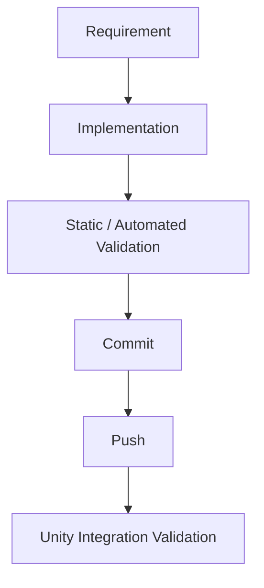

# NO-ROOT — Development Workflow

NO-ROOT의 개발 흐름은 요구사항을 구현하고, 정적·자동 검증과 Unity 통합 검증을 거쳐 실행 상태를 확인하는 과정으로 구성합니다.

이 문서는 프로젝트의 개발 방식을 설명합니다. 개별 변경의 검증 완료 여부와 결과는 해당 변경에서 실제로 수행한 확인 범위를 기준으로 판단합니다.

## 1. Requirement

기능이 동작해야 하는 조건과 결과를 먼저 정리합니다. 전투 능력, 성장 분기, 원정 선택, 저장 및 복원처럼 상태가 연결되는 기능은 시작 상태와 완료 상태를 함께 살펴봅니다.

요구사항 검토에서는 다음 내용을 명확히 하는 데 중점을 둡니다.

- 어떤 입력이나 상황에서 기능이 시작되는지
- 처리 과정에서 어떤 상태가 바뀌는지
- 완료 후 플레이어와 다른 시스템이 어떤 결과를 확인해야 하는지
- 재시도, 복원, 새 원정 시작처럼 다른 수명주기에 어떤 영향을 주는지

## 2. Implementation

정리한 요구사항을 Gameplay Runtime으로 구현합니다. 주요 개발 영역은 Combat, Ability Runtime, Character Progression, Hybrid Expedition, Persistence, Runtime Validation, UI Integration입니다.

예를 들어 원정 선택 기능은 후보 생성부터 선택 확정, 저장, 선택한 노드 진입까지 이어집니다. 구현을 검토할 때는 각 단계의 책임과 상태 변경 시점을 기준으로 연결 관계를 확인합니다.

## 3. Static / Automated Validation

코드 수준에서 확인할 수 있는 사항을 검토하고, 적용 가능한 자동 검증을 수행하는 단계입니다. 검증 결과를 읽을 때는 **무엇을 실행했는지와 무엇이 확인되었는지**를 함께 구분합니다.

| 확인 방식 | 확인할 수 있는 범위 | 결과 해석 |
| --- | --- | --- |
| 정적 검토 | 코드의 조건, 상태 전환, 호출 관계, 변경 범위 | 코드를 읽거나 분석한 범위의 근거입니다. |
| 컴파일 확인 | 구문, 타입, 참조 등 컴파일 과정의 오류 | 해당 환경에서 코드가 컴파일되는지 확인합니다. |
| 자동 테스트 실행 | 실행한 테스트가 다루는 조건과 기대 결과 | 테스트 실행 결과와 실제로 다룬 시나리오를 함께 기록합니다. |

자동 테스트 코드의 존재와 테스트 실행 결과는 별개의 정보입니다. 컴파일 확인 역시 테스트 실행이나 Unity에서의 플레이 확인과 구분하여 기록합니다. 검증하지 않은 조건은 완료 결과에 포함하지 않습니다.

## 4. Commit

변경을 검토 가능한 단위로 기록합니다. 변경 의도와 영향을 받는 시스템을 설명하고, 수행한 검증 범위를 함께 남기는 데 목적이 있습니다.

상태 관련 문제를 수정하는 경우에는 문제를 유발하는 조건, 변경한 동작, 확인한 결과가 연결되어야 검토자가 수정 이유를 이해할 수 있습니다.

## 5. Push

기록한 변경을 원격 저장소에 반영합니다. Push의 성공은 변경이 원격에 전달되었음을 의미합니다. 실제 게임 동작에 대한 확인은 다음 Unity 통합 검증 단계에서 이어집니다.

원본 개발 저장소인 `ShinInHa12/My-project`는 Private으로 유지합니다. 이 공개 저장소는 채용 검토를 위한 프로젝트 설명과 문서, 공개 범위를 검토한 코드 샘플을 관리하는 공간입니다.

## 6. Unity Integration Validation

Unity 실행 환경에서 구현한 기능과 연결된 시스템을 함께 확인합니다. 코드 수준의 검증 이후에도 입력, 씬, UI, 진행 상태, 저장 및 복원이 실제 플레이 흐름 안에서 맞물리는지 살펴봅니다.

| 영역 | 통합 검증에서 살펴보는 내용 |
| --- | --- |
| Combat Ability Runtime | 능력 입력과 Ready / Startup / Active / Recovery / Cooldown 상태의 연결 |
| Character Progression | Human / SourceBuild 성장 상태와 사용 가능한 기능의 관계 |
| Hybrid Expedition | 후보 생성 → 선택 → Edge Commit → 저장 → 선택 노드 진입의 연결 |
| Persistence | 후보 및 진행 상태의 저장과 복원 |
| Retry / New Run | 재시도와 새 원정 시작의 상태 유지·초기화 범위 |
| UI Integration | 입력과 화면 표시가 실제 런타임 상태와 일치하는지 여부 |

위 표는 확인 관점을 설명하며, 모든 항목의 테스트 통과를 주장하는 목록은 아닙니다. 특정 변경의 완료 판단에는 실제 실행 환경, 수행한 시나리오, 관찰한 결과가 필요합니다.

## 디버깅 기록의 기준

런타임 문제는 재현 조건, 관찰한 현상, 원인 근거, 변경 내용, 확인 결과를 연결해 설명합니다. 원인이나 수정 결과가 확인되지 않은 경우에는 그 범위를 구분해 기록합니다.

프로젝트에서 다룬 `HumanQMissing`과 Final Boss progression issue의 공개 소개는 [Troubleshooting](troubleshooting.md)에 정리합니다. 시스템 간 관계는 [Architecture](architecture.md)에서 확인할 수 있습니다.

[프로젝트 소개로 돌아가기](../README.md)
